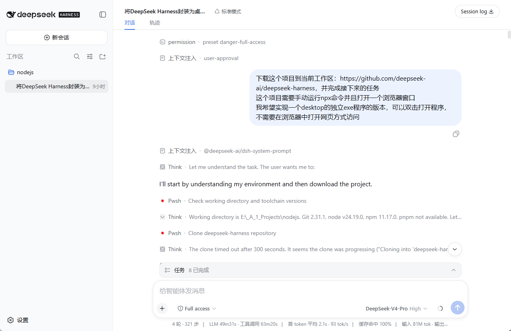
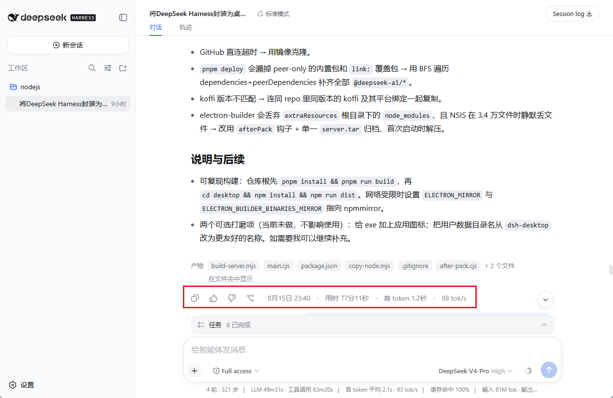
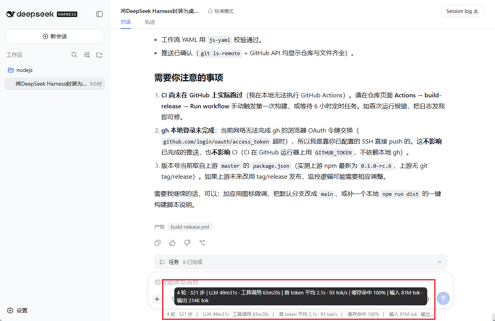
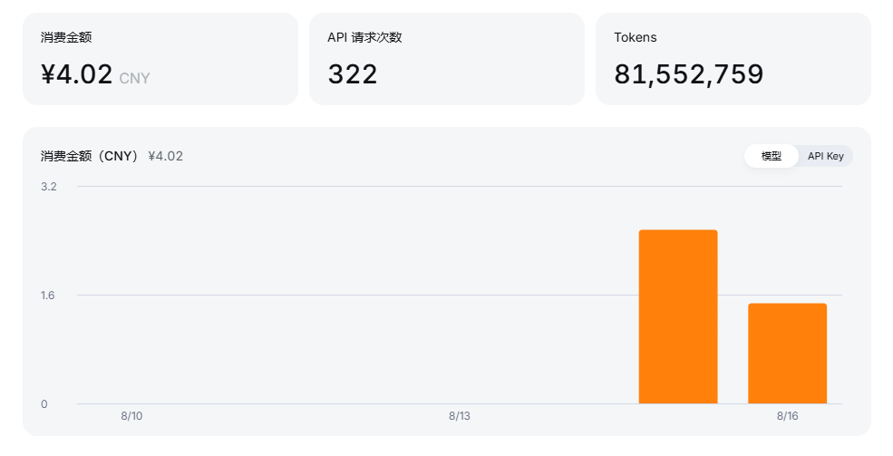

# 构建过程记录 · Build Process Record

本项目（DeepSeek Harness Desktop）从零到发布 Release 的完整过程，全程由
DeepSeek Harness（`dsh`）中的 agent 完成。以下是构建过程中的真实截图与花费记录。

## 1. 第一个任务

在 `dsh` 中发起的第一个任务：把 DeepSeek Harness 封装为可双击打开、无需浏览器的
独立桌面程序。

## 2. 第一个任务的结果

第一个任务完成后的结果——成功生成桌面版的可执行程序与构建产物。

## 3. 最后一个任务与总花费

最后一个任务（配置自动编译 CI、发布 Release、完善 README 与图标）及其总花费。

## 4. 花费明细

本次构建全程的花费明细。

> 全程总花费 **￥4.02**。
